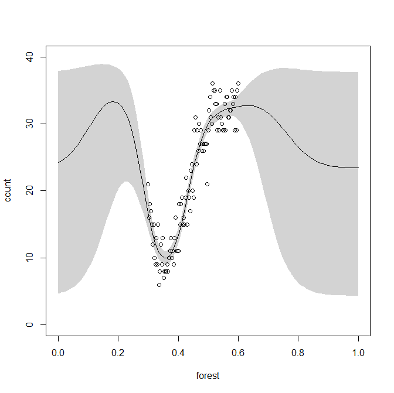
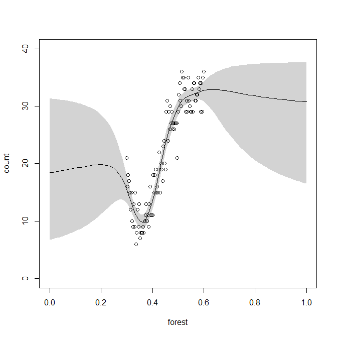

```{r, include = FALSE}
knitr::opts_chunk$set(
  collapse = TRUE,
  comment = "#>"
)
```

```{r eval=FALSE}
library(gp)
library(RTMB)
```

In this very simple example, we demonstrate basic use of the package.

First, let us generate some training data:

```{r}
forest <- seq(0.3,0.6, length.out = 100)
total <- rep(40, 100)

c1 <- rbinom(n = 20, size = 40, prob = seq(0.4, 0.2, length.out = 20))
c2 <- rbinom(n = 50, size = 40, prob = seq(0.2, 0.8, length.out = 50))
c3 <- rbinom(n = 30, size = 40, prob = seq(0.8, 0.8, length.out = 30))

count <- c(c1, c2, c3)
```

These are binomial counts; `count` might represent e.g. number of occupied sites out of the total number of sites, along a gradient of an environment variable (e.g. forest cover). Now, lets bundle the data for the `gp` package:

```{r}
x <- list(
	y = data.frame(count = count, total = total),
	env = data.frame(forest = forest)
)
```

We can now plot the data, with a simple regression line:

```{r, fig.align = "center", fig.dim = c(5,5)}
plot(forest[1:length(count)], count, ylim = c(0,40), xlim = c(0.2,0.7), xlab = "forest", ylab = "count")

m <- lm(count ~ forest, data = cbind(x$y, x$env))
abline(m)
```


Now, let us fit a simple Gaussian process. We start by writing a binomial likelihood function for our data, that is, defining the probability `p(y|f)`, where `f` is the Gaussian process. The likelihood is specified the same way as in the package \pkg{RTMB} (apart from RTMB's docs, see also [Ben Bolker's RTMB tips](https://github.com/bbolker/rtmb_tips) for a guideline on what to take care about when writing this function):

```{r}
nll <- function (data, f) # p(y|f) = function returning negative log-likelihood of the data, given f
{
	getAll(data, warn=FALSE)
	p <- plogis(f)

	-sum(dbinom(x = y$count, size = y$total, prob = p, log = TRUE))
}

```

Now, we bundle the data and prepare the model:

```{r, eval = FALSE}
xx <- gpData(x) # bundle the data

g <- gp(f = ~ i:1 + envN:cov.SE(env), xx, negLogLik = nll) # create model object
```

We have used a simple squared exponential covariance function. Now, let's run the model fit - can take a bit of time:

```{r, eval = FALSE}
g <- gpFit(g) # run the model fit (can take longer)
```

Now, after the model has been fit, it is a good idea to save it to the disk. But we need to pack it first, to remove some big cached matrices that are useful for predictions, but would unnecessarily take up space on a disk:

```{r, eval = FALSE, comment = "#"}
object.size(g) # model size before packing
# 256912 bytes

gpp <- gpPack(g) # pack the model for saving

object.size(gpp) # model size after packing
# 85600 bytes

save(gpp, file = "simple_example-model.Rdata") # save the packed model
```

In this case, the space saved by packing is small, but only because of small data size.

Later on, perhaps in a new R session, when we want to load the model, we will have to unpack it if we want to compute predictions:

```{r, eval = FALSE}
load(file = "simple_example-model.Rdata") # load the packed model
g <- gpUnpack(gpp) # unpack the model
```


Now, let us calculate model predictions along the environmental gradient:

```{r, eval = FALSE}
newdata <- gpData(list(
	env = data.frame(forest = seq(0, 1, length.out = 100))
))

pred <- predict(g, newdata, type = "response", se.fit = TRUE, link = "logit", parname = "p", maxn = Inf)
```

and plot the predictions:

```{r, eval = FALSE, fig.align = "center", fig.dim = c(5,5)}
# multiply the predicted probabilities by the total count, to get the same scale as the counts
p_scale <- pred[,c("p", "p_lower_95CI", "p_upper_95CI")]*40

plot(x$env$forest, x$y$count, ylim = c(0,40), xlim = c(0,1), xlab = "forest", ylab = "count")
polygon(c(newdata$env$forest, rev(newdata$env$forest)), c(p_scale[,"p_lower_95CI"], rev(p_scale[,"p_upper_95CI"])), col = "lightgray", border = NA)
lines(newdata$env$forest, p_scale[,"p"])
points(x$env$forest, x$y$count)
```


Now, let's try the same model, but without penalizing the length-scales of the squared exponential covariance function. The hyperparameter priors can be seen in the hyperparameter table:

```{r, eval = FALSE}
g$hyperpar

# A tibble: 3 × 14
  component cov_fun hyperpar   len     i table var    start       low    up  value fixed optim.link   prior                           
  <chr>     <chr>   <chr>    <dbl> <dbl> <chr> <chr>  <dbl>     <dbl> <dbl>  <dbl> <lgl> <chr>        <list>                          
1 i         NA      sigma2       1     1 NA    NA         1 0.0000001   100 0.0375 FALSE log          uniform_lp(x)                   
2 envN      NA      sigma2       1     1 NA    NA         1 0.0000001   100 1.20   FALSE log          sigma2_exp_lp(x, lambda = 3)    
3 envN      cov.SE  ls           1     1 env   forest   200 0.1         200 1.22   FALSE cubicrootlog lasso_ls(x, magn = 3 * 2.077589)
```

We can see that the length-scale of the envN component - hyperparameter "ls" on the 3rd line - has `lasso_ls` penalization prior. Now, we set 
the prior to uniform prior, which effectively means no penalization on the length-scale:

```{r, eval = FALSE}
g2 <- g

hy <- g2$hyperpar
hy$prior[hy$component == "envN" & hy$hyperpar == "ls"] <- list(quote(uniform_lp(x)))
```

Now, save the modified hyperparameter table and re-run the model:

```{r, eval = FALSE}
g2$hyperpar <- hy

g2 <- gpFit(g2)
```

Now, running the predict and plotting yields:


Now, instead of squared exponential covariance function, we can use neural network covariance function:

```{r, eval = FALSE}
g3 <- gp(f = ~ i:1 + envN:cov.NN.add(env), xx, logLik = ll)
g3 <- gpFit(g3)
```



Now, perform 3-fold cross-validation of the model

```{r, eval = FALSE}
fold <- sample(1:3, g$GP_size, replace = TRUE) # generate the folds randomly along the records

# register cluster of 3 workers for the parallel computation
library(parallel)
library(doParallel)

cl <- makeCluster(4)
registerDoParallel(cl)

# perform the 3-fold cross-validation!
g.cv <- gpFitCV(g, fold.col = fold)

registerDoSEQ() # unregister the parallel background
stopCluster(cl) # stop the cluster
```


